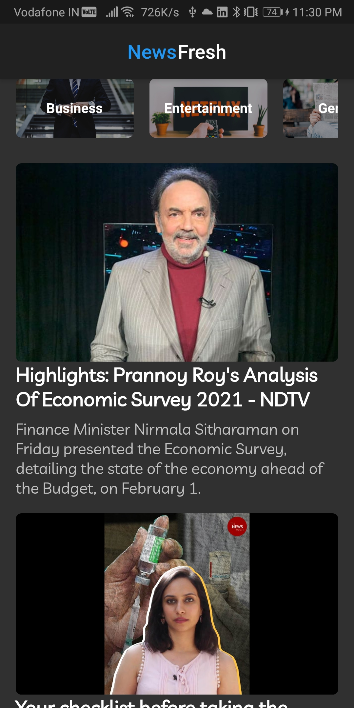
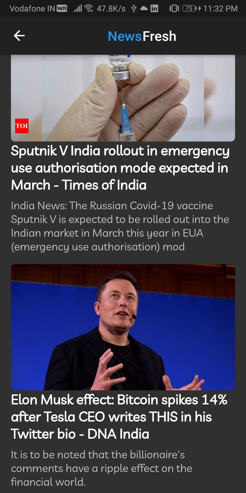
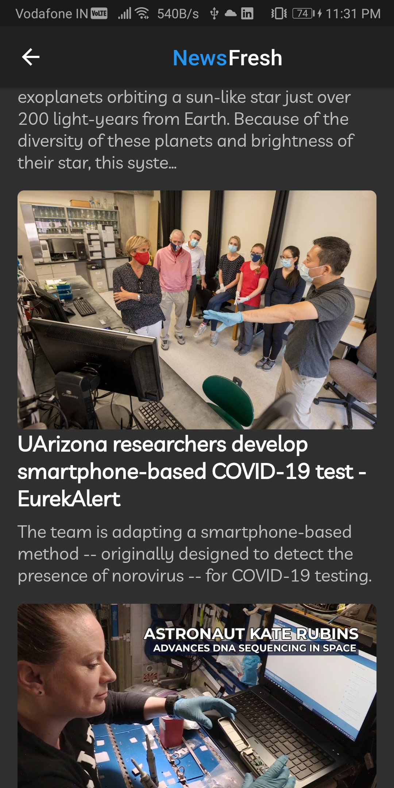

# News Fresh

News-Fresh will keep you updated with the latest news.

 

The [News API](https://newsapi.org/) was used to fetch the latest news.  
 

  Please star⭐ the repo if you like what you see😉.

## 💻 Requirements

- Any Operating System (ie. MacOS X, Linux, Windows)
- Any IDE with Flutter SDK installed (ie. IntelliJ, Android Studio, VSCode etc)
- A little knowledge of Dart and Flutter

## ✨ Features

- [x] Keeps you updated with the Latest News.
- [x] News categories - A vast variety in the same app like business, science, and technology, politics etc.
- [x] Simple userfriendly UI.

# 🔌 Plugins

| Name                                                    | Usage                                               |
| ------------------------------------------------------- | --------------------------------------------------- |
| [**Cached Network Image**](https://pub.dev/packages/cached_network_image) | Flutter library to load and cache network images. Can also be used with placeholder and error widgets.|
| [**Cupertino Icons**](https://pub.dev/packages/cupertino_icons)               | Default icons asset for Cupertino widgets based on Apple styled icons.|
| [**Http**](https://pub.dev/packages/http)               | A composable, multi-platform, Future-based API for HTTP requests.|
| [**Webview Flutter**](https://pub.dev/packages/webview_flutter) | A Flutter plugin that provides a WebView widget on Android and iOS..|

## 📸 ScreenShots

<!--  -->

| News                             |  News Categories                   |
| --------------------------------- | --------------------------------- |
|   |   |
|   |   |
|   |   |
|   |   |

